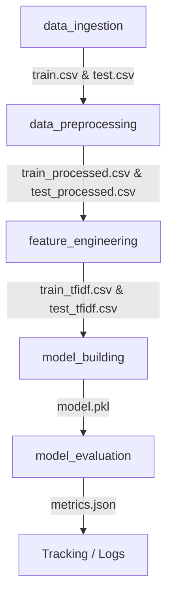

# Spam Detection MLOps Pipeline

This repository hosts a production-grade spam detection machine learning pipeline engineered with Python, DVC, AWS, Pytest, and Docker.

---

## 🛠️ Project Architecture



Each stage is defined modularly and tracked using Git and DVC.

---

## ⚡ Development & Setup

### 1. Prerequisites and Installation
Clone the repository and install dependencies:
```bash
pip install -r requirements.txt
```

### 2. Parameterization
All configurations are parameterized inside [params.yaml](file:///params.yaml), including:
- **Preprocessing rules**: lowercase settings and custom stopword language filtering
- **Feature dimension**: TF-IDF vocabulary top features limits
- **Estimator configurations**: RandomForest trees count, max tree depth, splits, and seeds

### 3. Run Pipeline with DVC
Reproduce stages end-to-end:
```bash
dvc repro
```

### 4. Running Unit Tests
Execute the pytest suite validates ETL stages, vectorization transformations, and estimator logic:
```bash
python -m pytest -v
```

---

## 🐳 Containerization with Docker

Build and run the entire pipeline inside a sandboxed Docker container:
```bash
# Build the MLOps pipeline image
docker build -t spam-pipeline .

# Run DVC pipeline reproduction inside container
docker run --rm spam-pipeline
```

---

## 📂 Project Structure
- `src/`: Modular task components for ETL and modeling
- `tests/`: Module unit test suites
- `params.yaml`: Configurations manager
- `dvc.yaml`: DVC orchestrator workflow representation
